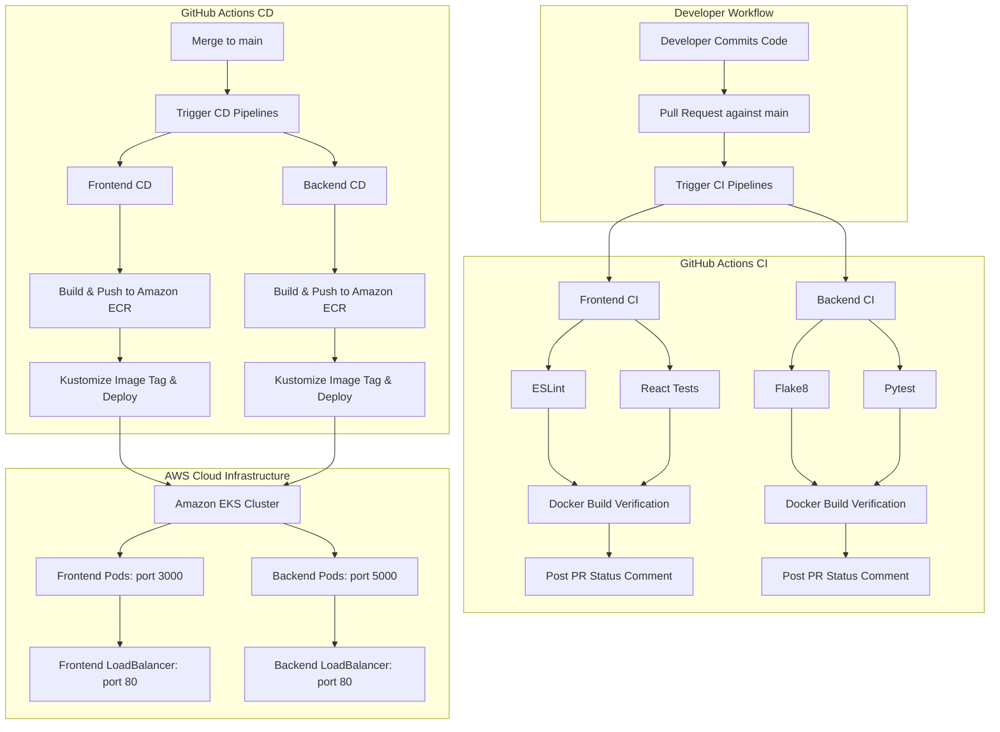

# 🎬 Movie Picture Pipeline — Automated CI/CD with GitHub Actions, AWS ECR & EKS

[](https://github.com/Adi51244/Movie-Picture-Pipeline/actions/workflows/frontend-ci.yaml)
[](https://github.com/Adi51244/Movie-Picture-Pipeline/actions/workflows/backend-ci.yaml)
[](https://github.com/Adi51244/Movie-Picture-Pipeline/actions/workflows/frontend-cd.yaml)
[](https://github.com/Adi51244/Movie-Picture-Pipeline/actions/workflows/backend-cd.yaml)


A production-grade, automated DevOps release pipeline for the **Movie Picture** catalog application. This project automates testing, linting, building, containerization, and continuous deployment of a multi-tier microservices application (React frontend + Python/Flask backend) to an **Amazon Elastic Kubernetes Service (EKS)** cluster with **Amazon Elastic Container Registry (ECR)** using **GitHub Actions**.

---

## 🌐 Live Deployed Endpoints

| Component | Service Type | Live URL | Description |
|---|---|---|---|
| **Frontend Web App** | AWS Classic LoadBalancer | [Live Frontend Catalog](http://a04274a5fcb7d4c1ea4ac3617054926a-516495786.us-east-1.elb.amazonaws.com) | Interactive React UI featuring glassmorphic dark cinema theme |
| **Backend REST API** | AWS Classic LoadBalancer | [Live Movie API (`/movies`)](http://a04f8212441f944338bd16afff9c1066-499144066.us-east-1.elb.amazonaws.com/movies) | Flask REST API returning movie catalog JSON data |

---

## 🏗️ Architecture Overview



---

## 📦 Tech Stack & Components

### 1. Frontend Application (`starter/frontend`)
* **Framework:** React 18 (JavaScript / JSX)
* **Styling:** Custom Vanilla CSS with modern dark mode, glassmorphism, and responsive grid layouts
* **Linter:** ESLint with Prettier integration
* **Testing:** React Testing Library + Jest
* **Containerization:** Node.js 18 Alpine multi-stage Docker image served via `serve`
* **Configuration:** Dynamically injected `REACT_APP_MOVIE_API_URL` pointing to backend load balancer

### 2. Backend API (`starter/backend`)
* **Framework:** Python 3.10 + Flask
* **Server:** uWSGI application server
* **Dependency Manager:** Pipenv (with `Pipfile` & `Pipfile.lock`)
* **Linter:** Flake8
* **Testing:** Pytest + Coverage
* **Containerization:** Alpine-based Python Docker image with optimized C compiler flags

### 3. Infrastructure & Cloud Deployment
* **Container Registry:** Amazon ECR (`frontend` & `backend` private repositories)
* **Orchestration:** Amazon EKS (`cluster`) running Kubernetes nodes in `us-east-1`
* **Manifest Management:** Kustomize for dynamic image tagging per Git SHA
* **Networking:** AWS Classic Load Balancers exposing frontend and backend on port 80

---

## 🚀 CI/CD Pipeline Specifications

### 1. Frontend Continuous Integration (`.github/workflows/frontend-ci.yaml`)
* **Triggers:** Pull requests to `main` impacting `starter/frontend/**`, and manual trigger (`workflow_dispatch`).
* **Jobs:**
  * `lint`: Runs ESLint on the frontend codebase.
  * `test`: Executes React unit tests using Jest.
  * *Parallel Execution:* `lint` and `test` execute concurrently.
  * `build`: Sets up Node.js, restores cache, installs dependencies, executes unit tests (`CI=true npm test`), and builds the Docker image only after `lint` and `test` succeed (`needs: [lint, test]`).
  * `pr-comment`: Automated bot that posts a markdown summary of CI results directly to the Pull Request.

### 2. Backend Continuous Integration (`.github/workflows/backend-ci.yaml`)
* **Triggers:** Pull requests to `main` impacting `starter/backend/**`, and manual trigger (`workflow_dispatch`).
* **Jobs:**
  * `lint`: Runs Flake8 linter on backend code.
  * `test`: Executes Pytest test suite.
  * *Parallel Execution:* `lint` and `test` execute concurrently.
  * `build`: Builds backend Docker image **only after** `lint` and `test` pass (`needs: [lint, test]`).
  * `pr-comment`: Posts status comments to the active Pull Request.

### 3. Frontend Continuous Deployment (`.github/workflows/frontend-cd.yaml`)
* **Triggers:** Pushes/merges to `main` impacting `starter/frontend/**`, and `workflow_dispatch`.
* **Jobs:**
  * `lint` & `test`: Verifies code quality prior to deployment.
  * `build-push-deploy`:
    * Configures AWS credentials from GitHub Secrets.
    * Authenticates with Amazon ECR using `aws-actions/amazon-ecr-login`.
    * Builds Docker image with `REACT_APP_MOVIE_API_URL` pointing to the backend ELB URL.
    * Tags image with the commit SHA (`${{ github.sha }}`) and pushes to ECR.
    * Updates local kubeconfig for Amazon EKS.
    * Uses Kustomize (`imranismail/setup-kustomize`) to set the new image tag.
    * Deploys manifests to EKS via `kubectl apply`.
    * Verifies zero-downtime rollout with `kubectl rollout status`.

### 4. Backend Continuous Deployment (`.github/workflows/backend-cd.yaml`)
* **Triggers:** Pushes/merges to `main` impacting `starter/backend/**`, and `workflow_dispatch`.
* **Jobs:**
  * `lint` & `test`: Validates backend tests and style before deployment.
  * `build-push-deploy`:
    * Authenticates with AWS and ECR.
    * Builds backend Docker image and pushes tagged image with commit SHA to ECR.
    * Connects to EKS cluster.
    * Updates image in Kustomize manifests and applies them to the cluster.
    * Verifies backend deployment rollout.

---

## 🌟 Stand-Out Features & Enhancements

1. **Custom Reusable Composite Actions:**
   * [`.github/actions/setup-node-deps`](file:///.github/actions/setup-node-deps/action.yml): Encapsulates Node.js setup, npm dependency caching, and clean installation (`npm ci`).
   * [`.github/actions/setup-python-deps`](file:///.github/actions/setup-python-deps/action.yml): Encapsulates Python setup, pipenv virtualenv caching, and dependencies installation.
2. **Automated Pull Request Status Reporter:**
   * Custom GitHub Script action that posts rich Markdown status tables with checkmarks (`✅`, `❌`, `⏭️`) on PRs.
3. **Robust Secret Sanitization:**
   * Shell-level newline/whitespace scrubbing (`tr -d '\r\n[:space:]'`) ensuring flawless CLI parameter expansion even if secrets contain trailing characters.
4. **Enhanced Cinema UI:**
   * Upgraded frontend with frosted glassmorphism, responsive grid layout, Google Fonts (`Plus Jakarta Sans`), and hover micro-animations.

---

## 📂 Repository Structure

```text
.
├── .github/
│   ├── actions/
│   │   ├── setup-node-deps/action.yml     # Reusable composite action for Node.js
│   │   └── setup-python-deps/action.yml   # Reusable composite action for Python
│   └── workflows/
│       ├── frontend-ci.yaml               # Frontend CI on Pull Request
│       ├── backend-ci.yaml                # Backend CI on Pull Request
│       ├── frontend-cd.yaml               # Frontend CD on push to main
│       └── backend-cd.yaml                # Backend CD on push to main
├── evidence/                              # Submission evidence and verification screenshots
│   ├── 1_aws_setup/                       # EKS cluster, node group, IAM verification
│   ├── 2_frontend_ci/                     # Frontend CI passing workflow runs
│   ├── 3_backend_ci/                      # Backend CI passing workflow runs
│   ├── 4_frontend_cd/                     # Frontend CD deployment runs
│   ├── 5_backend_cd/                      # Backend CD deployment runs
│   └── 6_deployment_proof/                # Live URLs, running pods, and Load Balancers
├── setup/                                 # Environment initialization scripts
│   ├── terraform/                         # EKS & AWS infrastructure configuration
│   └── init.sh                            # Kubernetes aws-auth configuration script
├── starter/
│   ├── frontend/                          # React client application
│   │   ├── k8s/                           # Kubernetes Deployment, Service, Kustomization
│   │   ├── src/                           # Components, styling, and tests
│   │   └── Dockerfile
│   └── backend/                           # Flask REST API
│       ├── k8s/                           # Kubernetes Deployment, Service, Kustomization
│       ├── movies/                        # Movie resources and endpoints
│       └── Dockerfile
└── README.md
```

---

## 🧪 Local Testing & Verification

### Frontend
```bash
cd starter/frontend
npm ci
npm run lint         # Run ESLint
CI=true npm test     # Run Jest unit tests

# Simulate test failure (for CI validation):
FAIL_TEST=true CI=true npm test

# Simulate lint failure:
FAIL_LINT=true npm run lint
```

### Backend
```bash
cd starter/backend
pipenv install --dev
pipenv run lint      # Run Flake8
pipenv run test      # Run Pytest

# Simulate test failure:
FAIL_TEST=true pipenv run test

# Simulate lint failure:
pipenv run lint-fail
```

---

## 🔒 Security & Secrets Configuration

All sensitive credentials are abstracted into GitHub Repository Secrets (`Settings → Secrets and variables → Actions`):

* `AWS_ACCESS_KEY_ID`: IAM user access key
* `AWS_SECRET_ACCESS_KEY`: IAM user secret key
* `AWS_ACCOUNT_ID`: AWS Account ID (`131212483135`)
* `AWS_REGION`: Target AWS deployment region (`us-east-1`)
* `EKS_CLUSTER_NAME`: Target EKS cluster name (`cluster`)

---

## 📄 License
This project is licensed under the [MIT License](LICENSE.md).
